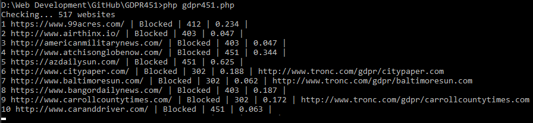

# GDPR451

GDPR451 is a php command line script for checking the availability of websites in the EU after GDPR became law on 25 May 2018.

The script checks the websites listed in `websites.csv` and saves the results to `results.csv`, it also outputs the results to a table in the terminal.

A full list of websites that are or were blocked can be found at: [https://data.verifiedjoseph.com/dataset/websites-not-available-eu-gdpr](https://data.verifiedjoseph.com/dataset/websites-not-available-eu-gdpr) or [https://github.com/VerifiedJoseph/data.verifiedjoseph.com-CSV-files/blob/master/website-blocked-gdpr.csv](https://github.com/VerifiedJoseph/data.verifiedjoseph.com-CSV-files/blob/master/website-blocked-gdpr.csv)

## Dependencies (via Composer)
```
league/csv
league/climate
```
## Limitations
- Script only checks response headers for changes not HTML.
